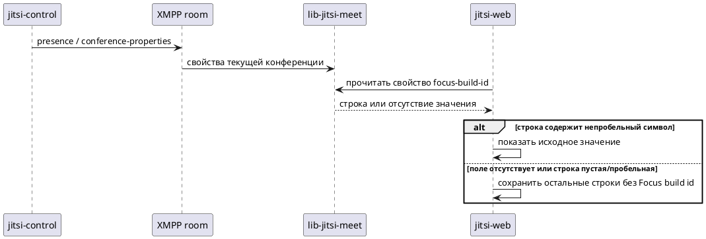

## Context

Изменение реализует capability `conference/focus-build-id-visibility`.
Цель и границы заданы в [Proposal](proposal.md), ожидаемое поведение — в
[Delta Specs](specs/conference/focus-build-id-visibility/spec.md).

Сервер уже передаёт участникам свойства конференции через XMPP presence.
Клиентская библиотека принимает произвольные ключи этих свойств. Веб-интерфейс
умеет показывать информационные строки конференции. Эти возможности подтверждены
адресным чтением существующего кода; новое поле и строка ещё не реализованы.

## Goals / Non-Goals

**Goals:** передать идентификатор сборки по существующему каналу и обеспечить
его условное отображение для всех участников по принятым требованиям.

**Non-Goals:** новый транспорт, отдельный запрос за значением, постоянное
хранение и изменение управления конференцией не требуются. Область
репозиториев остаётся той, что принята в Proposal.

## Architecture and interactions

`jitsi-control` публикует свойство в комнате конференции. XMPP-сервис доставляет
его участникам. `lib-jitsi-meet` предоставляет значение для текущей конференции,
а `jitsi-web` решает, показывать ли строку по нормативному условию из Specs.
Между библиотекой и интерфейсом нет нового сетевого запроса.



## Interaction / API contracts

### Публикация свойств конференции: сервер → клиентская библиотека

| Часть контракта | Текущее состояние | Изменение |
|---|---|---|
| Производитель | `jitsi-control` | Без изменения |
| Получатель через XMPP | `lib-jitsi-meet` участников текущей конференции | Без изменения |
| Операция | Публикация XMPP presence в MUC-комнате | В существующие свойства добавляется `focus-build-id` |
| Адрес комнаты | JID вида `{room}@{muc-domain}` | Новая комната или маршрут не вводятся |
| Адрес отправителя при доставке участнику | `{room}@{muc-domain}/{focus-resource}` | Существующий Focus-участник комнаты |
| URL/URI контракта | `http://jitsi.org/protocol/focus` — namespace элемента `conference-properties` | Namespace сохраняется; это идентификатор XML-протокола, не HTTP endpoint |
| HTTP URL и метод | Для этого обмена неприменимы: используется XMPP presence | Отдельного HTTP API не появляется |
| Формат | Вложенные элементы `property` с атрибутами `key` и `value` | Новый ключ в той же структуре |

`room`, `muc-domain` и `focus-resource` берутся из существующего подключения
к текущей конференции. Они зависят от окружения и комнаты; фиксированное имя
домена не является частью доработки. Обычная MUC-доставка направляет presence
участникам этой комнаты.

| Новое поле | Контракт |
|---|---|
| Место | `presence / conference-properties / property`, где `key="focus-build-id"` |
| Тип `value` | Строка, идентификатор сборки текущего сервера конференции |
| Обязательность | Необязательное поле; старый сервер может его не передавать |
| Формат значения | Непрозрачная строка; клиент не разбирает версию и не меняет содержание |
| Отсутствие | Элемент с этим ключом отсутствует; текст `"null"` не является обозначением отсутствия |
| Пустая/пробельная строка | Может быть получена; условие отображения определено в Specs |
| Default клиента | Значение не подставляется |

Пример фрагмента сообщения после изменения. `build-2026.09` — условное
значение; остальные свойства конференции сохраняются:

```xml
<conference-properties xmlns="http://jitsi.org/protocol/focus">
  <property key="focus-build-id" value="build-2026.09"/>
</conference-properties>
```

До изменения и при отсутствии значения в этом элементе нет свойства с ключом
`focus-build-id`. XML-экранирование остаётся частью существующего формата передачи,
а полученное строковое значение предоставляется потребителю без нормализации.

Свойства принимаются от Focus текущей комнаты. Доступ к новому значению совпадает
с принятой аудиторией: все участники, независимо от роли модератора.
Новые коды ошибок, повторы запросов или таймауты для одного поля не вводятся.
Сохраняется обработка общего XMPP-соединения; отсутствие поля само по себе
не означает ошибку соединения или сервера.

### Чтение свойства: клиентская библиотека → веб-интерфейс

Существующий интерфейс чтения свойств текущей конференции используется без
расширения: вход — ключ `focus-build-id`, результат — исходная строка либо
отсутствие значения. Это локальный публичный интерфейс библиотеки, отдельный
URL к нему неприменим.

Новое поведение потребителя задают Requirements «Conference info shows the
Focus build id when known» и «Conference info omits the Focus build id row
when the value is not provided». Проверка пустоты влияет только на видимость:
например, значение `"  build-2026.09  "` остаётся таким же при отображении.
Это явно проверяется Scenario `display-conference-focus-build-id-006` первого
из названных Requirements. Длинное значение использует существующее представление
Conference info без отдельного обрезания по Requirement
«Long Focus build ids use the existing presentation».

## Decisions

1. **Источник:** существующий идентификатор сборки сервера из метаданных его
   поставки, уже включённый в передаваемую участникам строку версии.
   Полная версия вместо идентификатора отклонена: она изменяет выбранное
   содержимое поля. Отдельно вычислять идентификатор из Git не требуется.
   Решение обеспечивает Requirement «Conference info shows the Focus build id when known».
2. **Передача:** расширить существующую публикацию свойств в presence.
   Дополнительный HTTP-запрос потребовал бы нового адреса, доступа и обработки
   сбоев без принятой необходимости. Поле публикуется с начальными свойствами
   конференции; идентификатор соответствует обслуживающей её сборке.
3. **Клиентская библиотека:** использовать существующую передачу произвольных
   свойств. Новая логика разбора не нужна; её участие в Change ограничено
   подтверждением контракта. Это обеспечивает совместимость из Requirement
   «Focus build id visibility is compatible with a Focus that does not provide the value».
4. **Интерфейс:** добавить строку в существующее представление Conference info,
   доступную по умолчанию при выполнении условия из Specs, без ограничения
   по роли модератора. Отдельный экран не требуется. Используются действующие
   правила оформления и доступности информационных строк.
   Основание — Requirements «Conference info shows the Focus build id when known»
   и «Focus build id visibility is available to all participants».

## Repository Implementation Map

| Repository | Responsibility | Contracts and dependencies |
|---|---|---|
| `jitsi-control` | Публиковать идентификатор сборки в свойствах текущей конференции | Производитель XMPP-контракта выше |
| `lib-jitsi-meet` | Подтвердить передачу нового свойства существующим механизмом; рабочая логика не меняется | Принимает свойства сервера и предоставляет значение веб-интерфейсу |
| `jitsi-web` | Отображать новое поле по принятым условиям видимости и доступа | Потребитель локального интерфейса чтения свойства |

## Risks / Trade-offs

- **Заметность версии сервера.** Аудитория и состав передаваемых сведений
  сохраняются, но значение становится проще найти. Это следует из принятого
  требования доступности строки всем участникам.
- **Сборка без заполненных метаданных.** Существующий источник может возвращать
  строку `build.git`, которая не различает конкретные сборки. Она остаётся
  обычным непустым значением и показывается по Specs. Это ограничение
  диагностической полезности; новая попытка определить сборку не вводится.
- **Несколько изменений одного интерфейса.** Аналогичное поле версии и новое
  поле сборки используют одну область UI. Каждая строка должна сохранять
  независимость и не требовать реализации другой доработки.

## Migration, rollout and rollback

Миграция сохранённых данных не нужна. Сервер и веб-клиент можно обновлять
независимо: новый клиент со старым сервером не показывает строку; старый клиент
с новым сервером продолжает прежнее поведение; новое поле видно, когда его
публикация и отображение поддержаны обеими сторонами.

В рассматриваемой версии `lib-jitsi-meet` уже есть нужная передача свойств.
Её новая рабочая версия для этой функции не требуется. Утверждение о любых
исторических версиях библиотеки здесь не делается.

В пилоте совместимость проверяется на текущих версиях компонентов Change.
Сообщение без `focus-build-id` моделирует сервер без поддержки нового поля.
Отдельное развёртывание исторических версий не требуется; поэтому результат
не распространяется на версии, не вошедшие в эту проверку.

Откат серверной доработки прекращает публикацию поля. В новых подключениях
оно отсутствует; для уже подключённых клиентов результат зависит от получения
обновлённых свойств или переподключения. Немедленное исчезновение старого значения
без обновления состояния не гарантируется. Откат веб-доработки убирает строку.
Откат только проверок `lib-jitsi-meet` не меняет рабочее поведение и не убирает
поле. Порядок выпуска определяется существующим процессом проекта.

## Open questions

Открытых вопросов нет.
