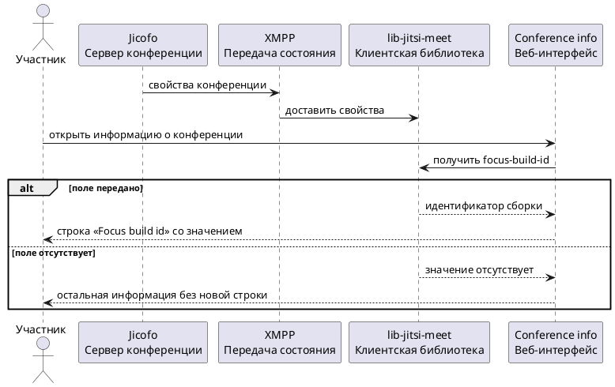

# Описание задачи

## 0. Тип изменения

Расширение существующего поведения и изменение интерфейса.

## 1. Задача и исходные материалы

Инженеру поддержки нужно видеть идентификатор сборки сервера, который управляет
текущей конференцией. Это поможет сопоставить обращение пользователя с версией
сервера и проверить, относится ли проблема к определённой сборке.

Источник — согласованная задача владельца: добавить поле на сервере и показать
его в интерфейсе; при отсутствии значения строка не появляется. Принятые границы
и ожидаемое поведение описаны в разделе 2. Отдельная Jira Story не предоставлена.

Для понимания системы использованы:

- `openspec/context/03-architecture.md` — роли систем и репозиториев;
- `openspec/context/05-constraints.md` — ограничения проекта;
- `design.md` и `tasks.md` Change `display-conference-focus-version` —
  подтверждённые сведения о передаче свойств конференции и статус аналогичной
  незавершённой доработки. Граница применимости этого источника указана в разделе 9.

## 2. Что нужно изменить

### 2.1. Проблема и ожидаемый результат

**Сейчас:** в информации о конференции нет отдельной строки с идентификатором
сборки Focus — сервера Jicofo, управляющего конференцией. Для расследования
обращения инженер поддержки не может получить это значение на данном экране.

**Ожидается:** в разделе Conference info появится строка «Focus build id» со
значением от сервера. Идентификатор сборки (build ID) нужно показывать без
изменения его содержания. Поведение при отсутствии значения описано в 2.3.

В задачу входят передача нового поля сервером, его прохождение через клиентскую
библиотеку и отображение в интерфейсе. Для библиотеки предусмотрена точечная
проверка существующей передачи свойств; новая логика обработки не запланирована.
Затрагиваемые репозитории перечислены в разделе 8.

За границами задачи остаются новый способ обмена данными, маршрутизация медиа,
выбор видеомоста, аутентификация и изменения `jitsi-videobridge`.
Сохраняется существующий канал передачи свойств конференции — см. 2.4.

Признаки успеха, по которым можно проверить результат:

1. При известном идентификаторе сборки участник находит его в Conference info.
2. Показанное значение совпадает с переданным сервером.
3. При отсутствии значения выполняется сценарий 2.3.
4. Доступ к строке соответствует разделу 4.

Способы автоматической и ручной проверки этих признаков определяются в Tasks и
Verify. Наличие описанного сценария не означает, что проверка уже выполнена.

### 2.2. Основной сценарий

1. Участник подключается к конференции, сервер которой передаёт идентификатор сборки.
2. Участник открывает Conference info в веб-интерфейсе.
3. Интерфейс показывает строку «Focus build id» с полученным значением.
4. Инженер поддержки может использовать это значение при разборе обращения.

Техническая передача значения между системами описана отдельно в 2.4.

### 2.3. Другие сценарии и исключения

**Значение отсутствует.** Если сервер не передал `focus-build-id`, например
потому, что его версия ещё не поддерживает поле, интерфейс не показывает строку,
заглушку или сообщение об ошибке. Остальная информация о конференции остаётся
доступной. Само отсутствие поля не устанавливает причину: оно не доказывает
недоступность сервера.

**Участник не является модератором.** При наличии значения строка доступна
на тех же условиях, что и модератору; правило доступа приведено в разделе 4.

Поведение при переданном пустом или некорректном значении пока не уточнено —
см. открытые вопросы раздела 9. Отсутствующее поле и пустая строка не
считаются одинаковыми без принятого правила.

### 2.4. Взаимодействие систем

Согласовано использование существующей передачи свойств конференции:

- `jitsi-control` (Jicofo) добавляет `focus-build-id` в
  `ConferenceProperties` — набор свойств, передаваемых участникам через
  XMPP presence, сообщения о состоянии в комнате конференции;
- `lib-jitsi-meet` принимает эти свойства и предоставляет их веб-клиенту;
- `jitsi-web` получает значение и отображает его по сценарию 2.2.

Новый отдельный запрос за идентификатором не предусмотрен. Поэтому отдельные
таймауты и повторные запросы именно для этого поля не вводятся; обработка
общего соединения остаётся существующей. Источник значения в Jicofo ещё
нужно подтвердить на Design.

### 2.5. Интерфейс

Экран — Conference info в веб-клиенте. Новая строка служит для чтения;
редактирование значения пользователем не предусмотрено.

| Наименование | Компонент | Свойство в структуре данных | Действие | Возможное значение | Примечания |
|---|---|---|---|---|---|
| Focus build id | Строка в Conference info | `focus-build-id` | Показать значение сервера | Идентификатор сборки; формат уточняется на Design | Отсутствие — 2.3; доступ — раздел 4 |

Отдельный индикатор загрузки для этого поля не предусмотрен. Пока значение
не получено, действует сценарий отсутствия. Ориентир для оформления — другие
информационные строки этого раздела.

Расположение, поведение длинного значения на узком экране и доступность для
экранных дикторов пока не описаны; вопросы перечислены в разделе 9.
Готовое отображение нового поля ещё не подтверждено.

### 2.6. Дополнительные правила поведения

Фильтрация, сортировка, пагинация и проверка пользовательского ввода к этой
строке не применимы: она показывает одно значение и не принимает ввод.
Дополнительные действия и уведомления для поля не запрошены.

## 3. Макеты

Отдельный макет не предоставлен. Ориентир — оформление существующих
информационных строк Conference info. Неуточнённые условия представления
приведены в 2.5 и разделе 9.

## 4. Доступ и права

Принятое в Proposal поведение: значение доступно всем участникам конференции.
Отдельная привилегия или ограничение только для модераторов не вводятся.
Существующие правила подключения к конференции не меняются.

Это правило ожидаемого поведения. Реализация и фактическая видимость поля
участникам ещё не проверены.

## 5. Схема взаимодействия

Диаграмма показывает ожидаемый путь значения из 2.4 и условное отображение
из сценариев 2.2–2.3.

## 6. Данные, безопасность и аудит

Предполагается использовать уже публичный идентификатор сборки Jicofo.
Точный источник и состав строки пока не подтверждены — вопрос остаётся
открытым в разделе 9. До уточнения нельзя считать проверенным отсутствие
чувствительных сведений в выбранном значении.

Нового постоянного хранения, журналирования или аналитики в задаче не
предусмотрено. Поле передаётся как свойство текущей конференции. Это граница
изменения, а не утверждение об отсутствии журналов или правил безопасности
в существующем продукте.

## 7. Ошибки и работа с ограничениями

Отсутствие поля обрабатывается по 2.3. Новые сообщения об ошибках и отдельное
восстановление для поля не предусмотрены. Общая обработка ошибок подключения
остаётся прежней.

Неизвестные условия обработки некорректного значения вынесены в раздел 9.

### 7.1. Совместимость и существующие данные

Предусмотрена совместимость нового интерфейса с сервером, который ещё не
передаёт поле: применяется сценарий отсутствия. Остальные свойства конференции
должны сохранять своё поведение.

Новое постоянное хранение не запланировано (раздел 6), поэтому миграция
записей в рамках текущего решения не предусмотрена. Применимость существующего
механизма передачи к нужным версиям клиентов уточняется на Design; отдельная
матрица поддерживаемых версий в исходной задаче не задана.

### 7.2. Качество и эксплуатация

Отдельные требования к задержке, нагрузке и доступности для этого поля не
предоставлены. Числовые пороги и новые SLA не устанавливаются этим Intake.
Общие ограничения проекта остаются применимыми.

Поле помогает диагностике обращений по сборке сервера. Отдельные метрики и
оповещения для него не запрошены. Отсутствие поля само по себе не является
ошибкой; его причина может потребовать обычной диагностики соединения и сервера.

Вопросы удобства чтения и доступности интерфейса находятся в 2.5 и разделе 9.

### 7.3. Введение изменения

Отдельный переключатель и поэтапное включение не заданы. Условие показа —
получение значения интерфейсом, поддерживающим новую строку. Одного обновления
сервера недостаточно для появления строки в старом интерфейсе.

Порядок обновления компонентов и условия выпуска определяются в Design
и принятом процессе поставки. Intake не устанавливает новые правила выпуска.

## 8. Какие системы могут потребовать изменений

| Репозиторий | Зачем затрагивается |
|---|---|
| `jitsi-control` | Передать идентификатор сборки сервера |
| `lib-jitsi-meet` | Подтвердить передачу нового свойства существующим механизмом; изменение рабочей логики не запланировано |
| `jitsi-web` | Показать значение участнику |

Эти три репозитория заданы в исходной задаче и перечислены в Repository Impact
текущего Proposal. Остальные репозитории не включены.

## 9. Что известно и что нужно уточнить

### Подтверждённые факты

- Роли систем из раздела 8 подтверждены
  `openspec/context/03-architecture.md`.
- Существование механизма передачи свойств из 2.4 подтверждено адресным
  исследованием, описанным в разделе Context файла
  `openspec/changes/display-conference-focus-version/design.md`.
  Это сведения о текущем коде, а не результат проверки новой функции.
- Аналогичный Change выбрал этот механизм для `focus-version`, но его
  публикация нового поля и отображение в UI ещё не подтверждены как завершённые.
  Источник — его Design и открытые Tasks. Уточнение при редактуре Intake:
  прежние формулировки ошибочно представляли принятое решение как готовую функцию.
- Цель, границы и условия отображения в разделах 1–4 взяты из согласованной
  задачи и текущего Proposal; они описывают ожидаемое поведение.

### Предположения

В Jicofo имеется подходящий для передачи публичный идентификатор сборки.
Предположение следует из исходной постановки, но точное значение и его состав
не подтверждены. Подтверждение или опровержение должно обновить этот раздел
и раздел 6 с указанием источника.

### Противоречия

Известное смешение принятого решения и готовой реализации устранено при
редактуре — основание указано выше. Других подтверждённых противоречий нет.

### Открытые вопросы

1. Какое существующее значение Jicofo является идентификатором сборки и
   допустимо ли его показывать всем участникам? Точный источник и состав
   проверяются на Design; отсутствие подходящего публичного значения требует
   решения владельца.
2. Как трактовать переданное пустое или некорректное значение? Это ожидаемое
   поведение нужно уточнить перед завершением соответствующих Specs.
3. Как показывать длинный идентификатор на узком экране и обеспечить чтение
   вспомогательными средствами? Нужны правила представления в Design с учётом
   действующих требований интерфейса.
4. Какие версии клиентов входят в обязательную проверку совместимости?
   Если общих правил проекта недостаточно, состав проверки следует уточнить
   перед завершением Tasks.

Вопросы 2–4 выявлены при проверке полноты Intake по обновлённому шаблону.
Ответы на них не приписываются владельцу и не объявляются согласованными.

## 10. Результаты исследования

### Состояние

`not_required` для отдельного Explore перед Proposal: исходная задача
достаточна для постановки цели и границ. Поздние уточнения перечислены в
разделе 9 и должны быть разрешены на соответствующих этапах.

### Вопросы исследования

Отдельное исследование в рамках этого Intake не выполнялось. Технические
вопросы для Design перечислены в разделе 9.

### Что удалось выяснить

Новые результаты Explore не получены. Использованы ранее предоставленные
сведения; их источники и границы применимости указаны в разделе 9.

### Решения и оставшиеся вопросы

Новых бизнес-решений при редактуре не принято. Нерешённые вопросы находятся
в разделе 9.

### Источники

Источников нового Explore нет. Материалы, использованные при подготовке
и актуализации Intake, перечислены в разделах 1 и 9.

## 11. Готовность к следующему шагу

Intake описывает согласованную цель и границы; Proposal уже подготовлен.
При редактуре уточнён статус текущего поведения и выявлены открытые вопросы
из раздела 9. Их нужно учитывать при подготовке Specs, Design и Tasks;
закрывать их предположениями нельзя.

planning_route: ready_for_proposal

Маркер означает достаточность аналитики для Proposal и не предлагает создать
его заново. Фактический следующий этап определяется текущим Work Context.
