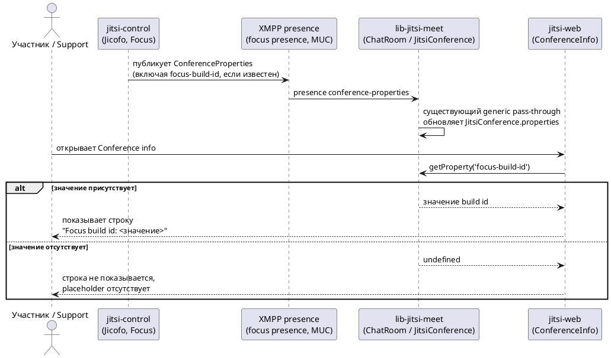

# Описание задачи

## 0. Тип изменения

Расширение существующего поведения — используется уже установленный в продукте
паттерн: presence-объект `ConferenceProperties`, который `jitsi-control` (Jicofo)
публикует в focus presence, и generic pass-through, которым `lib-jitsi-meet` уже
переносит такие свойства в `JitsiConference.properties`. Дополнительно это
изменение интерфейса: в `jitsi-web` добавляется новая строка Conference info.

## 1. Задача и исходные материалы

Источник согласованной задачи — Daily Intent Brief, сформированный в этом диалоге,
и явное Gate 0 подтверждение владельца задачи:

> «The owner confirms this synthetic pilot intent: support engineers need to see
> the exact Focus build identifier in Conference info when Jicofo provides it,
> while older or unavailable backends must produce no row and no placeholder.
> The scope is exactly the three repositories already named and the transport is
> the existing ConferenceProperties presence path.»

Jira Story отсутствует. Это второй synthetic multi-repo pilot после уже принятого
и частично реализованного Change `display-conference-focus-version`: он закрепил
для той же тройки репозиториев ровно тот же presence-путь и generic pass-through,
и служит подтверждённым источником анализа текущего поведения для этой задачи
(см. раздел 9).

Использованные материалы Store: `openspec/context/03-architecture.md` (зоны
ответственности `jitsi-control`, `lib-jitsi-meet`, `jitsi-web`),
`openspec/context/05-constraints.md`, а также `proposal.md`, `design.md` и
`tasks.md` Change `display-conference-focus-version`.

## 2. Что нужно изменить

### 2.1. Проблема и ожидаемый результат

Support-инженеры расследуют инциденты, специфичные для конкретной сборки Focus
(`jitsi-control`, роль Jicofo) — например, чтобы понять, содержит ли обслуживающая
конференцию сборка уже выпущенное исправление. Сегодня точный build id сборки не
виден в интерфейсе конференции, и его пришлось бы добывать другим способом.
Нужно показать его прямо в Conference info, когда Jicofo его предоставляет.

Ожидаемый результат: когда Jicofo публикует build id, участник видит точную
строку со значением в Conference info; когда более старый или недоступный по
этому признаку backend его не публикует, строка и любой placeholder отсутствуют
полностью — то есть поведение выглядит как сегодня, без изменений.

Входит в задачу: публикация `jitsi-control` записи `focus-build-id` через уже
существующий presence-путь `ConferenceProperties`; точечный contract test в
`lib-jitsi-meet`, подтверждающий, что существующий generic pass-through переносит
именно эту запись; условная строка в Conference info в `jitsi-web`.

Не входит в задачу: любой новый транспорт или протокол; новая generic-логика в
`lib-jitsi-meet` (используется как есть); placeholder или частичное состояние
интерфейса при отсутствии значения; изменения `jitsi-videobridge`; изменения
маршрутизации медиа, выбора моста или аутентификации.

Ограничения: ровно три репозитория — `jitsi-control`, `lib-jitsi-meet`,
`jitsi-web`; используется только уже существующий presence-путь
`ConferenceProperties`.

Признаки успеха:
1. `jitsi-control` публикует запись `focus-build-id` в `ConferenceProperties` тем
   же presence-путём, что и другие записи этого объекта.
2. `lib-jitsi-meet` переносит `focus-build-id` в `JitsiConference.properties` без
   изменения generic-логики; это подтверждено одним точечным contract test.
3. `jitsi-web` показывает строку Conference info с точным значением
   `focus-build-id`, когда оно присутствует, и не показывает ни строку, ни
   placeholder, когда оно отсутствует.

Проверка результата — на уровне Apply/Verify каждого репозитория: локальный
набор тестов `jitsi-control` и `lib-jitsi-meet` плюс ручная проверка в `jitsi-web`
(этот репозиторий не имеет автотестов для `react/features`, что уже
задокументировано прецедентом `display-conference-focus-version`).

### 2.2. Основной сценарий

Jicofo (`jitsi-control`) публикует в focus presence запись `focus-build-id` в
составе уже существующего объекта `ConferenceProperties`. `lib-jitsi-meet`
существующим generic pass-through переносит эту запись в
`JitsiConference.properties` без какой-либо специальной обработки конкретного
ключа. Участник или support-инженер открывает Conference info в `jitsi-web`;
интерфейс читает значение через `getProperty('focus-build-id')` и показывает
строку с точным значением.

### 2.3. Другие сценарии и исключения

- Jicofo не публикует `focus-build-id` (старая или недоступная в этом отношении
  сборка backend): строка Conference info не показывается, placeholder не
  показывается, ошибка не показывается — поведение идентично сегодняшнему.
- Значение присутствует, но участник не является модератором: строка
  показывается так же, как и модератору — по прецеденту `focus-version` доступ
  не ограничивается ролью (подтверждается в Proposal/Delta Spec).

### 2.4. Взаимодействие систем

`jitsi-control` публикует объект `ConferenceProperties` (включающий, при
наличии, `focus-build-id`) в уже существующей focus presence в XMPP MUC комнате
конференции. `lib-jitsi-meet` уже подписан на изменение presence-элемента
`conference-properties` и переносит все его записи в
`JitsiConference.properties` без allow-list по ключу — тем же путём, что и для
`focus-version`. `jitsi-web` читает значение через
`JitsiConference.getProperty('focus-build-id')` и рендерит условную строку.
Асинхронного запроса/ответа с таймаутом и повторными попытками здесь нет — это
однонаправленная передача уже сформированного presence-состояния.

### 2.5. Интерфейс

| Наименование | Компонент | Свойство в структуре данных | Действие | Возможное значение | Примечания |
|---|---|---|---|---|---|
| Строка "Focus build id" в Conference info | `ConferenceInfo` (`jitsi-web`) | conference property `focus-build-id`, читаемая через `JitsiConference.getProperty` | Отображение строки со значением | Точная строка build id, опубликованная Jicofo | Видна всем участникам без ограничения по роли; строка появляется только когда значение присутствует |

Отдельного состояния загрузки нет — значение приходит вместе с уже загруженными
свойствами конференции, тем же путём, что и у существующей строки "Focus
version". Пустой результат равносилен отсутствию строки (см. 2.3); отдельного
состояния ошибки не предусмотрено.

### 2.6. Дополнительные правила поведения

Не применимо — фильтрация, сортировка, пагинация и отдельная валидация ввода не
затрагиваются.

## 3. Макеты

Не применимо — отдельный макет не предоставлен. Строка визуально повторяет
существующий паттерн условных строк Conference info. Принятый Change
`display-conference-focus-version` использует тот же паттерн как проектное
решение, но его presence-реализация ещё не считается завершённым runtime-фактом.

## 4. Доступ и права

Не применимо — строка видна всем участникам конференции без ограничения по
роли, по прецеденту `display-conference-focus-version`.

## 5. Схема взаимодействия

Диаграмма показывает основной сценарий (2.2) и ветку отсутствия значения (2.3):
взаимодействуют три компонента (`jitsi-control`, `lib-jitsi-meet`, `jitsi-web`)
через внешнюю зависимость (XMPP presence), поэтому диаграмма обязательна.

## 6. Данные, безопасность и аудит

Значение — уже существующий публичный build id Jicofo; изменение не вводит
новую категорию чувствительных данных, новое хранение, журналирование или
аудит сверх удержания свойства в памяти текущей конференции в
`lib-jitsi-meet` (тот же характер данных, что и у уже принятого
`focus-version`).

## 7. Ошибки и работа с ограничениями

Единственный учитываемый случай ограничения — отсутствие значения у Jicofo
(старая или недоступная в этом отношении сборка): интерфейс не показывает ни
строку, ни placeholder, ни состояние ошибки (см. 2.3). Отдельного состояния
таймаута или недоступности не предусмотрено, так как передача происходит через
уже установленное presence-соединение, а не отдельный запрос.

## 8. Какие системы могут потребовать изменений

- `jitsi-control` — публикация новой записи `focus-build-id` в уже
  существующем объекте `ConferenceProperties`.
- `lib-jitsi-meet` — без изменения production-логики; добавляется точечный
  contract test на уже существующий generic pass-through.
- `jitsi-web` — условная строка в Conference info.

Состав и границы репозиториев по прецеденту `display-conference-focus-version`
(Repository Impact той задачи перечисляет ровно эти три репозитория для
аналогичной по форме capability). Точный состав фиксируется в Proposal этой
задачи.

## 9. Что известно и что нужно уточнить

### Подтверждённые факты

- Presence-путь `ConferenceProperties`, генерируемый `jitsi-control`
  (`JitsiMeetConferenceImpl`) и публикуемый в focus presence, уже существует и
  уже используется для нескольких записей — см. раздел 2.4 и
  `openspec/changes/display-conference-focus-version/design.md` (раздел
  Context, подтверждено Apply-evidence и адресной CodeGraph-проверкой этой же
  тройки репозиториев).
- `lib-jitsi-meet` уже переносит произвольные записи presence-элемента
  `conference-properties` в `JitsiConference.properties` без allow-list по
  ключу — см. тот же источник.
- `jitsi-web`'s `ConferenceInfo` уже поддерживает паттерн условных строк.
  Видимость нового поля всем участникам и отсутствие строки при отсутствии
  значения — требование этой задачи, а не утверждение о готовой реализации
  предыдущего Change.
- Ответственность репозиториев (`jitsi-control`, `lib-jitsi-meet`,
  `jitsi-web`) — `openspec/context/03-architecture.md`, раздел «Ответственность
  сторон».

### Предположения

- У `jitsi-control` уже есть публичное значение build id, отличное от строки
  версии (`focus-version`), пригодное для публикации как есть. Это
  предположение опирается на формулировку задачи владельца («existing public
  Focus build identifier») и требует одной точечной проверки текущего
  состояния кода на этапе Design (см. «Открытые вопросы»), а не нового
  исследования на этапе Intake/Proposal.

### Противоречия

Не выявлены.

### Открытые вопросы

- Где именно в `jitsi-control` уже существует публичное значение build id
  (отдельное поле/функция, отличная от `CurrentVersionImpl.VERSION`) и как оно
  сейчас называется/вычисляется? Это единичный current-state вопрос,
  подлежащий проверке через CodeGraph на этапе Design, а не блокер для
  Proposal или Delta Spec: наблюдаемое поведение (presence-запись, generic
  pass-through, условная строка) не зависит от точного внутреннего источника
  значения.

## 10. Результаты исследования

### Состояние

`not_required`. Подтверждённого контекста из Gate 0 intent владельца и
подтверждённого прецедента `display-conference-focus-version` достаточно для
Proposal и Delta Spec этой задачи. Единственный оставшийся технический вопрос
(точный источник значения build id в `jitsi-control`) — предмет отдельной,
уже предусмотренной схемой `spec-driven-extended` точечной CodeGraph-проверки на
этапе Design, а не Explore на этапе Intake.

### Вопросы исследования

Не применимо — Explore не запрашивается на этом этапе.

### Что удалось выяснить

Не применимо.

### Решения и оставшиеся вопросы

Не применимо.

### Источники

Не применимо.

## 11. Готовность к следующему шагу

Владелец явно подтвердил Gate 0 intent с точным составом репозиториев,
транспортом и наблюдаемым поведением present/absent. Подтверждённый прецедент
`display-conference-focus-version` показывает, что presence-путь
`ConferenceProperties` и generic pass-through в `lib-jitsi-meet` существуют в
текущем коде и пригодны для новой записи. Это не означает, что ещё открытая
presence-задача предыдущего Change уже реализована.
Остаётся только один точечный технический вопрос (точный источник значения
build id в `jitsi-control`), который не меняет ни scope, ни наблюдаемое
поведение и относится к Design, а не к Proposal. Поэтому задача готова к
Proposal.

planning_route: ready_for_proposal
