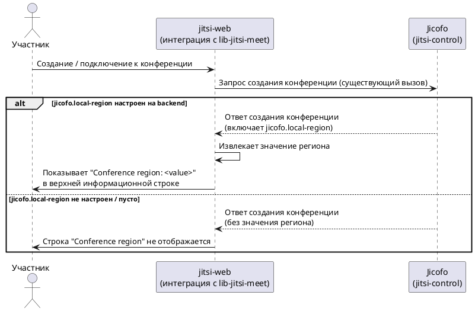

# Описание задачи

## 0. Тип изменения

Изменение интерфейса, техническое изменение, расширение существующего поведения.

Изменение расширяет уже существующий ответ Jicofo на создание конференции новым
диагностическим полем и уже существующую верхнюю информационную строку конференции
в jitsi-web новым текстовым label. Новой интеграции и изменений доступа/прав в
задаче нет.

## 1. Задача и исходные материалы

Источник согласованной задачи — Daily Intent Brief, сформулированный и принятый
пользователем в текущей сессии (сессия `spec-driven-extended-intent`).

Jira Story не предоставлена: пользователь явно указал, что тикета нет. Других
документов или макетов передано не было.

## 2. Что нужно изменить

### 2.1. Проблема и ожидаемый результат

Сейчас участники встречи и эксплуатация не видят, каким инфраструктурным регионом
focus-сервиса (Jicofo) обслуживается конкретная конференция. Это затрудняет
диагностику проблем региональной маршрутизации: например, непонятно, к какому
региону подключился конкретный клиент, если задержки или сбои связаны с
конкретным регионом.

Явного бизнес-обоснования или связанной Jira Story нет — мотивация "почему именно
сейчас" зафиксирована только со слов пользователя в этой сессии как рабочее
предположение (диагностика/наблюдаемость) и вынесена в раздел 9 как допущение.

Ожидаемый результат: Jicofo включает настроенное значение `jicofo.local-region` в
ответ создания конференции, а jitsi-web показывает это значение пользователю в
существующей верхней информационной строке конференции.

В задачу входит:
- добавление значения `jicofo.local-region` в ответ создания конференции на
  стороне jitsi-control (Jicofo) вместе с тестами;
- чтение и фиксация значения в lib-jitsi-meet вместе с тестами;
- получение значения через API lib-jitsi-meet, обновление типов и UI jitsi-web.

В задачу не входит:
- изменения в jitsi-videobridge — репозиторий не затрагивается;
- преобразование значения региона в человекочитаемое имя или локализация значения —
  оно выводится как обычный текст в том виде, в котором его передал backend;
- отдельный блок или новый визуальный элемент интерфейса — используется существующая
  строка.

Ограничение поведения: если backend не передал регион (значение отсутствует или
пустое), новая строка в интерфейсе не показывается — интерфейс выглядит как раньше,
без ошибок и без пустых заполнителей.

Критерии успеха:
- ответ создания конференции от Jicofo содержит значение `jicofo.local-region`,
  когда оно настроено на backend;
- jitsi-web показывает `Conference region: <value>` в верхней информационной строке
  конференции, когда значение получено;
- при отсутствии значения строка не отображается;
- изменение покрыто тестами в jitsi-control и lib-jitsi-meet, а UI-код jitsi-web
  проходит его статические проверки.

Проверка результата выполняется через автотесты и статические проверки в трёх
репозиториях. Визуальная проверка строки в запущенной конференции остаётся отдельным
ручным шагом.

### 2.2. Основной сценарий

Backend (Jicofo) настроен со значением `jicofo.local-region`. Участник создаёт или
подключается к конференции. Jicofo формирует ответ создания конференции и включает
в него настроенное значение региона. jitsi-web (через адаптированную интеграцию с
lib-jitsi-meet) получает это значение из ответа и добавляет в существующую верхнюю
информационную строку конференции (компонент `ConferenceInfo` / `details-container`,
где уже отображаются тема встречи, таймер и другие короткие labels) компактный
текстовый label `Conference region: <value>`.

### 2.3. Другие сценарии и исключения

- Jicofo не настроен со значением `jicofo.local-region`, либо конфигурация задаёт
  пустое значение: ответ создания конференции не содержит региона (или содержит
  пустое значение). jitsi-web не показывает строку `Conference region` — верхняя
  информационная строка выглядит так же, как без этого изменения.

Поведение jitsi-web в случае, если адаптированная интеграция с lib-jitsi-meet не
смогла распознать/разобрать переданное значение (ошибка на стороне клиента, а не
отсутствие значения на backend) — решено на Design, см. раздел 9.

### 2.4. Взаимодействие систем

Jicofo (jitsi-control) и jitsi-web уже взаимодействуют в рамках существующего
процесса создания конференции; новое взаимодействие не создаётся — расширяется
состав данных в уже существующем ответе.

- jitsi-web обращается к Jicofo в рамках существующего процесса создания/подключения
  к конференции.
- Jicofo включает в ответ создания конференции настроенное значение
  `jicofo.local-region`, если оно задано в конфигурации.
- jitsi-web получает ответ через свою интеграцию с зависимостью lib-jitsi-meet
  (версия зафиксирована/pinned), которая адаптируется для извлечения нового
  значения, и передаёт его в UI-слой. Точный технический способ адаптации этой
  интеграции — решено на Design, см. раздел 9.

Точное имя поля/атрибута на уровне протокола (wire-level контракт ответа) —
решено на Design: свойство называется `focus-region`, см. раздел 9.

Таймауты, повторные попытки и идемпотентность отдельно не обсуждались: новое
значение передаётся в рамках уже существующего вызова создания конференции, а не
через отдельный запрос.

### 2.5. Интерфейс

Пользователь подтвердил точное место размещения: существующая верхняя
информационная строка встречи (компонент `ConferenceInfo` / `details-container`), в
которой уже находятся тема встречи (subject), таймер и другие короткие labels. Это
не диалог дозвона/приглашения и не панель статистики соединения.

| Наименование | Компонент | Свойство в структуре данных | Действие | Возможное значение | Примечания |
|---|---|---|---|---|---|
| Conference region | `ConferenceInfo` / `details-container` (верхняя информационная строка конференции) | значение региона, полученное из ответа создания конференции (`jicofo.local-region`) | Отображение компактного текстового label `Conference region: <value>` рядом с существующими labels (subject, timer и др.) | Строка региона, как её передал backend, либо значение отсутствует | Label показывается только при непустом значении; отдельный блок не создаётся; значение выводится как обычный текст без интерактивности |

Загрузка отдельно не описывается: значение приходит вместе с уже существующим
ответом создания конференции, как и остальные labels этой строки. Пустой результат
— label не отображается (подтверждено). Поведение при ошибке разбора значения на
стороне клиента не уточнялось (см. раздел 9). Соответствие дизайн-системе и
адаптивность нового label пользователем не описывались; предполагается, что label
использует то же визуальное оформление, что и соседние labels этой строки —
это допущение, а не подтверждённое решение (см. раздел 9).

### 2.6. Дополнительные правила поведения

Фильтрация, сортировка, пагинация и уведомления не применимы — добавляется один
статичный текстовый label в существующую строку.

## 3. Макеты

Не применимо — макет не предоставлен, используется существующий компонент верхней
информационной строки конференции без изменения его общей структуры.

## 4. Доступ и права

Не применимо — значение региона является диагностической инфраструктурной
информацией, а не персональными или иными чувствительными данными; ограничения
доступа или ролей пользователем не описывались.

## 5. Схема взаимодействия

Диаграмма показывает добавление значения региона в существующий процесс создания
конференции: Jicofo включает значение в ответ, jitsi-web (через адаптированную
интеграцию с lib-jitsi-meet) читает его и показывает или скрывает label в
зависимости от наличия значения.

## 6. Данные, безопасность и аудит

Значение региона — инфраструктурная диагностическая информация (имя/код настроенного
региона), не персональные данные. Требований к аудиту, дополнительному скрытию или
фильтрации запросов пользователь не указывал.

## 7. Ошибки и работа с ограничениями

Подтверждённый случай: если backend не передал значение региона (не настроено или
пусто), интерфейс не показывает строку и не показывает ошибку — поведение
эквивалентно текущему состоянию до этого изменения.

Решено на Design (раздел 9): поведение при ошибке разбора значения на стороне
клиента (в адаптированной интеграции с lib-jitsi-meet), а также поведение при
изменении региона после создания конференции (например, при миграции focus).

## 8. Какие системы могут потребовать изменений

- `jitsi-control` — формирование ответа создания конференции с настроенным
  значением `jicofo.local-region`; тесты backend. Причина: источник значения
  региона.
- `lib-jitsi-meet` — чтение нового свойства, фиксация первоначального значения и
  публичный getter. Причина: библиотека владеет разбором ответа конференции.
- `jitsi-web` — обновление типов и UI (верхняя информационная строка
  конференции). Причина: отображение значения пользователю.
- `jitsi-videobridge` — изменений не требуется; пользователь явно подтвердил, что
  этот репозиторий не затрагивается.

Repository-id соответствуют реестру проекта (`jitsi-control`, `lib-jitsi-meet`,
`jitsi-web`, `jitsi-videobridge`, роль `code`). Точный состав репозиториев в
Repository Impact подтверждён на Proposal.

## 9. Что известно и что нужно уточнить

### Подтверждённые факты

- Проблема, ожидаемый результат, scope и критерии успеха — раздел 2.1; источник:
  принятый в этой сессии Daily Intent Brief и последующие ответы пользователя.
- Основной сценарий и точное место в интерфейсе (`ConferenceInfo` /
  `details-container`, верхняя информационная строка) — раздел 2.2, 2.5; источник:
  прямой ответ пользователя в этой сессии.
- Поведение при отсутствии значения региона (строка скрывается, без ошибки) —
  раздел 2.3, 2.5, 7; источник: ответ пользователя.
- Затронутые репозитории и явное исключение jitsi-videobridge — раздел 8;
  источник: ответ пользователя, сверено с реестром репозиторий проекта.

### Предположения

- Мотивация "почему сейчас" — диагностика/наблюдаемость региональной маршрутизации;
  явного бизнес-обоснования или Jira не предоставлено.
- Новый label визуально оформлен так же, как соседние labels строки
  `ConferenceInfo` (subject, timer) — выведено из формулировки "компактный label в
  той же строке", отдельно не подтверждено.

### Скорректировано на Design

- Исходная формулировка предполагала адаптацию pinned-зависимости внутри
  jitsi-web. При реализации выяснилось, что web исполняет собранный UMD-артефакт,
  поэтому локальный patch затронул бы generated minified code. Владеющий разбором
  репозиторий `lib-jitsi-meet` добавлен в реестр и Repository Impact; jitsi-web
  использует его публичный getter. Наблюдаемое поведение Change не изменилось.

### Противоречия

Не выявлены.

### Открытые вопросы

Все вопросы ниже были заданы на этапе Intake и закрыты пользователем на этапе
Design (переданы как решения Design в команде `/opsx:ff` этой же сессии, до
записи `design.md`). Формулировка вопроса сохранена как исходный источник,
рядом указано принятое решение.

- Точный wire-level контракт поля в ответе создания конференции — **решено**:
  свойство называется `focus-region`; Jicofo добавляет его только при непустом
  `jicofo.local-region`. См. Design.
- Поведение jitsi-web при ошибке разбора переданного значения на стороне клиента
  — **решено**: отсутствующее, пустое или не распознанное значение трактуется
  одинаково — label скрывается без ошибки.
- Обновляется ли отображаемое значение региона при миграции focus — **решено**:
  нет, значение фиксируется один раз из первоначального ответа создания
  конференции и далее не обновляется.
- Локализация и адаптивность нового label — **частично решено**: подпись
  выводится через существующую i18n-систему проекта (локализуемый текст),
  значение подставляется verbatim как безопасный React text. Точная адаптивная
  вёрстка на разных размерах экрана отдельно не уточнялась и остаётся на
  усмотрение реализации существующего компонента строки.

## 10. Результаты исследования

### Состояние

not_required — согласованного контекста от Intent и ответов пользователя достаточно
для подготовки Proposal. Оставшиеся открытые вопросы (точный wire-контракт,
поведение при ошибке разбора, live-обновление значения, адаптивность) относятся к
уровню Design и не меняют согласованные scope, наблюдаемое поведение или состав
затронутых репозиториев.

### Вопросы исследования

Не применимо — исследование не запрашивалось.

### Что удалось выяснить

Не применимо.

### Решения и оставшиеся вопросы

Не применимо.

### Источники

Не применимо.

## 11. Готовность к следующему шагу

Собранного контекста достаточно для подготовки Proposal: проблема, ожидаемый
результат, точное место в интерфейсе, состав затронутых репозиториев (включая явное
исключение jitsi-videobridge) и критерии успеха согласованы. Оставшиеся открытые
вопросы (раздел 9) касаются деталей уровня Design (точный контракт ответа, поведение
при ошибке разбора, локализация) и не блокируют формулирование Proposal.

`planning_route: ready_for_proposal`
