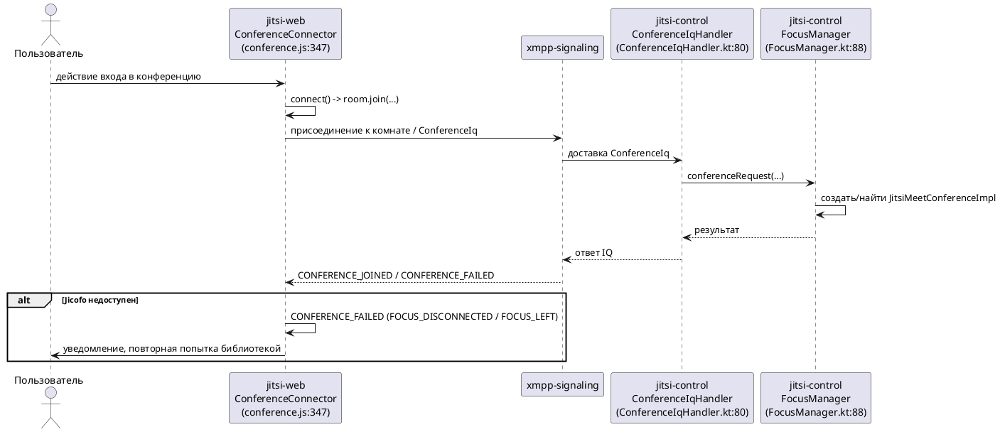

# Описание задачи

## 0. Тип изменения

Техническое изменение (developer documentation). Наблюдаемое поведение системы
не меняется — изменяется только состав документации в двух Code Repositories.

## 1. Задача и исходные материалы

Согласованный источник задачи — прямое указание пользователя в текущей рабочей
сессии (smoke-окружение), сформулированное как принятый intent: добавить
проверенную документацию для разработчиков о пути входа в конференцию от
`jitsi-web` до `jitsi-control`; runtime-поведение не менять. Jira Story не
предоставлена и не требуется для этого технического изменения.

Дополнительные материалы:
- `openspec/context/03-architecture.md` — уже фиксирует связь `jitsi-web → jitsi-control`
  на уровне ответственности, без точных code-anchors.
- Evidence CodeGraph, собранный в этой сессии через `openspec-orch plugin exec codegraph
  explore/query` для `jitsi-web` и `jitsi-control` (раздел 9).

## 2. Что нужно изменить

### 2.1. Проблема и ожидаемый результат

Разработчики, которые впервые знакомятся с проектом или расследуют инцидент на
границе клиент/фокус-сервис, не имеют проверенного описания пути входа в
конференцию: какой код в `jitsi-web` инициирует подключение, как он передаёт
запрос в `jitsi-control` (Jicofo) и какой код в `jitsi-control` принимает этот
запрос. Существующий `openspec/context/03-architecture.md` называет связь на уровне
ответственности, но не даёт code-level точки входа и не подтверждён построчным
чтением исходников.

Ожидаемый результат — в `jitsi-web` и `jitsi-control` появляется документация
(markdown в соответствующем репозитории), которая точно называет функции/классы
входной точки на стороне клиента и точки приёма запроса на стороне Jicofo, и
описывает наблюдаемый путь между ними со ссылками на код. Runtime-поведение
(код, конфигурация, тесты, сборка) не меняется — правится и добавляется только
документация.

В задачу входит: описание пути от действия пользователя/клиента в `jitsi-web`
до создания или присоединения к конференции в `jitsi-control`. За границей
задачи: медиа-путь к `jitsi-videobridge` (он документируется отдельным Change
`document-media-routing-boundaries`), изменение поведения XMPP-сигнализации,
любые изменения кода.

Ограничение: документация должна ссылаться только на код, подтверждённый чтением
(через CodeGraph или прямое чтение), а не на предположения о поведении.

Признак успеха и способ проверки: в каждом из двух репозиториев добавлен/обновлён
markdown-документ, который называет точную входную функцию, содержит путь к файлу
и номер строки, и проходит ручную проверку (review) на соответствие текущему коду.

### 2.2. Основной сценарий

1. Разработчик открывает документацию `jitsi-web` о входе в конференцию.
2. Документ называет `ConferenceConnector.connect()` (`conference.js:347`) как
   точку, с которой клиент вызывает `room.join(...)` — присоединение к комнате
   конференции lib-jitsi-meet, что инициирует XMPP-сигнализацию к фокус-сервису.
3. Разработчик переходит к документации `jitsi-control` о приёме запроса.
4. Документ называет `ConferenceIqHandler.handleConferenceIq(query: ConferenceIq)`
   (`jicofo/src/main/kotlin/org/jitsi/jicofo/xmpp/ConferenceIqHandler.kt:80`) как
   точку приёма запроса и `FocusManager.conferenceRequest`
   (`jicofo/src/main/kotlin/org/jitsi/jicofo/FocusManager.kt:88`) как шаг, который
   создаёт или находит конференцию (`JitsiMeetConferenceImpl`).
5. Разработчик получает подтверждённую, читаемую картину пути без необходимости
   самостоятельно трассировать код в обоих репозиториях.

### 2.3. Другие сценарии и исключения

- Разработчик читает только один из двух документов (например, только
  `jitsi-control`) — документ должен быть понятен и ссылаться на смежный
  документ в другом репозитории, а не требовать чтения обоих одновременно.
- Код, на который ссылается документация, меняется в будущем — вне текущей
  задачи; риск устаревания документации зафиксирован как ограничение в Design,
  без нормативного механизма актуализации в рамках этого Change.

### 2.4. Взаимодействие систем

Задача не меняет взаимодействие систем — она описывает уже существующее
наблюдаемое взаимодействие:
- `jitsi-web` инициирует присоединение к комнате конференции через lib-jitsi-meet
  (`room.join`), что приводит к XMPP-сигнализации в сторону фокус-сервиса.
- `jitsi-control` (Jicofo) принимает `ConferenceIq` через XMPP IQ handler
  (`ConferenceIqHandler.handleConferenceIq`) и создаёт/находит конференцию через
  `FocusManager.conferenceRequest`.
- Обмен синхронный на уровне обработки IQ (IQ-запрос/ответ); повторные попытки и
  идемпотентность самого протокола не входят в область документации entrypoint
  и не переопределяются этой задачей.

### 2.5. Интерфейс

Не применимо — задача не затрагивает пользовательский интерфейс.

### 2.6. Дополнительные правила поведения

Не применимо — правила фильтрации, сортировки и валидации ввода не затронуты.

## 3. Макеты

Не применимо — документация не содержит UI-изменений.

## 4. Доступ и права

Не применимо — права доступа к коду и конференциям не меняются; речь о
добавлении markdown-файлов в существующие Code Repositories по их обычному
процессу ревью.

## 5. Схема взаимодействия

Диаграмма нужна: путь входа затрагивает два взаимодействующих компонента
(`jitsi-web` и `jitsi-control`) через внешнюю сигнальную систему (XMPP) и имеет
значимую ветку ошибки (`FOCUS_DISCONNECTED`/`FOCUS_LEFT`, когда Jicofo
недоступен). Диаграмма показывает подтверждённый основной сценарий входа в
конференцию и не вводит неподтверждённых участников (например, конкретный XMPP
MUC-сервис как отдельный компонент не detalizируется, так как код клиента и
Jicofo взаимодействует с ним как с внешней системой `xmpp-signaling`, уже
упомянутой в `openspec/context/03-architecture.md`).

## 6. Данные, безопасность и аудит

Не применимо — документация не раскрывает секреты и не описывает новые
хранимые данные; ссылки на код используют только уже публичные пути в открытых
репозиториях проекта.

## 7. Ошибки и работа с ограничениями

Соответствующая ветка ошибки описана в разделе 5 (Jicofo недоступен →
`FOCUS_DISCONNECTED`/`FOCUS_LEFT` в `conference.js`, обработка в
`ConferenceConnector._onConferenceFailed`). Дополнительных ограничений, кроме
риска устаревания документации при будущих изменениях кода (раздел 2.3), не
выявлено.

## 8. Какие системы могут потребовать изменений

- `jitsi-web` — добавление/обновление markdown-документации о клиентской точке
  входа. Причина: здесь находится код, инициирующий подключение к конференции.
- `jitsi-control` — добавление/обновление markdown-документации о приёме запроса
  и создании конференции. Причина: здесь находится код фокус-сервиса, который
  получает запрос от клиента.
- `jitsi-videobridge` — изменения не предполагаются. Причина: путь входа в
  конференцию (join) не проходит через код видеомоста; медиа-путь документируется
  отдельным Change `document-media-routing-boundaries`.

Точный состав репозиториев и характер влияния (documentation/no-change)
подтверждается пользователем в разделе 9 как согласованный факт и принимается
окончательно в Proposal.

## 9. Что известно и что нужно уточнить

### Подтверждённые факты

- Пользователь подтвердил Repository impact: `jitsi-web` и `jitsi-control` —
  documentation, `jitsi-videobridge` — no-change (раздел 1).
- `conference.js:347` (`ConferenceConnector.connect()`) вызывает
  `room.join(...)` — раздел 2.2, источник CodeGraph explore `jitsi-web`,
  раздел 9 "Источники".
- Комментарий в коде явно называет Jicofo при обработке
  `FOCUS_DISCONNECTED` ("Jicofo is not available, but it is going to give it
  another try", `conference.js:286-290`) — раздел 2.3/5.
- `ConferenceIqHandler.handleConferenceIq` (`ConferenceIqHandler.kt:80`)
  принимает `ConferenceIq` и обрабатывает его — раздел 2.2, источник CodeGraph
  explore `jitsi-control`.
- `FocusManager.conferenceRequest` (`FocusManager.kt:88`) — шаг создания/поиска
  конференции, вызывается из `ConferenceIqHandler` — раздел 2.2, источник
  CodeGraph explore `jitsi-control`.
- `openspec/context/03-architecture.md` уже фиксирует связь `jitsi-web → jitsi-control`
  на уровне ответственности (без построчных anchors) — раздел 1.

### Предположения

- Названные точки входа (`ConferenceConnector.connect`,
  `ConferenceIqHandler.handleConferenceIq`, `FocusManager.conferenceRequest`)
  являются достаточным и репрезентативным описанием "пути входа" для целей
  developer-документации; более глубокая трассировка через lib-jitsi-meet
  (внешняя зависимость, не входит в индексируемый код `jitsi-web`) не
  выполнялась и не требуется для уровня детализации entrypoint-документа.

### Противоречия

Не выявлены.

### Открытые вопросы

Не выявлены — состав репозиториев, характер влияния и техническая точка входа
подтверждены достаточно для перехода к Proposal.

## 10. Результаты исследования

### Состояние

not_required — пользователь подтвердил repository impact и предоставил достаточно
контекста; техническая точка входа подтверждена CodeGraph evidence в этой же
сессии (раздел 9), отдельный Explore не требуется.

### Вопросы исследования

Отсутствуют.

### Что удалось выяснить

Не применимо (Explore не запускался).

### Решения и оставшиеся вопросы

Не применимо.

### Источники

- CodeGraph explore, repository `jitsi-web`, checkout
  `/private/tmp/openspec-jitsi-pilot.qjWHIr/workspace/src/jitsi-web`, запрос
  "conference.js:347 connect and how ConferenceConnector/JitsiMeetJS.init leads
  to room join and XMPP MUC/focus (Jicofo) invite", вызван через
  `openspec-orch plugin exec --repo jitsi-web codegraph explore`.
- CodeGraph query, repository `jitsi-web`, запрос "conference.js connect
  createInitialLocalTracksAndConnect", вызван через
  `openspec-orch plugin exec --repo jitsi-web codegraph query`.
- CodeGraph query, repository `jitsi-control`, запрос "FocusManager
  conferenceRequest room joined", вызван через
  `openspec-orch plugin exec --repo jitsi-control codegraph query`.
- CodeGraph explore, repository `jitsi-control`, checkout
  `/private/tmp/openspec-jitsi-pilot.qjWHIr/workspace/src/jitsi-control`, запрос
  "FocusManager.conferenceRequest handling a client ConferenceIq to
  create/join a JitsiMeetConference and how it relates to ConferenceRequest and
  the XMPP IQ handler", вызван через
  `openspec-orch plugin exec --repo jitsi-control codegraph explore`.
- `openspec/context/03-architecture.md` — существующая связь
  `jitsi-web → jitsi-control`.

## 11. Готовность к следующему шагу

Задача, состав репозиториев и техническая точка входа подтверждены; открытых
вопросов, способных изменить Specs, Design или Tasks, нет. Можно переходить к
Proposal.

planning_route: ready_for_proposal
